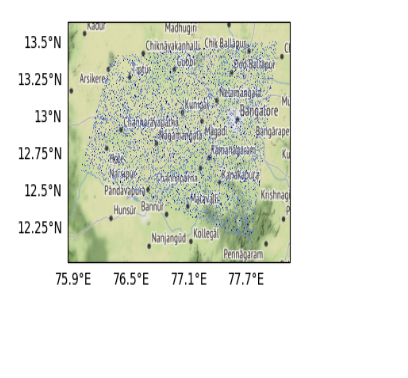

## About
This repo contains a python script for visualising a set of random coordinates inside a bounding box defined by four latitude and longitude coordinates.

## Usage:

Run main.py

It will show save an HTML file in the HTML directory which would look like this:

## License
This repo is licensed under MIT License